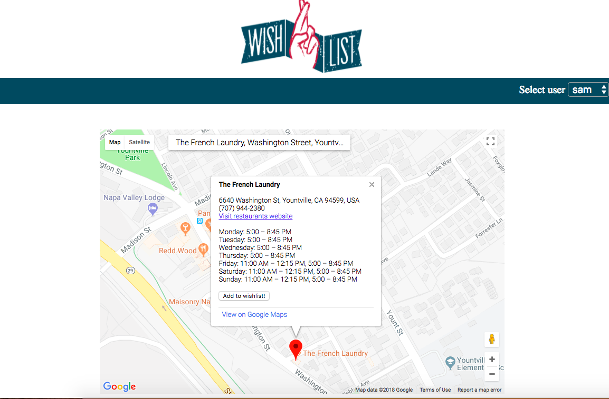
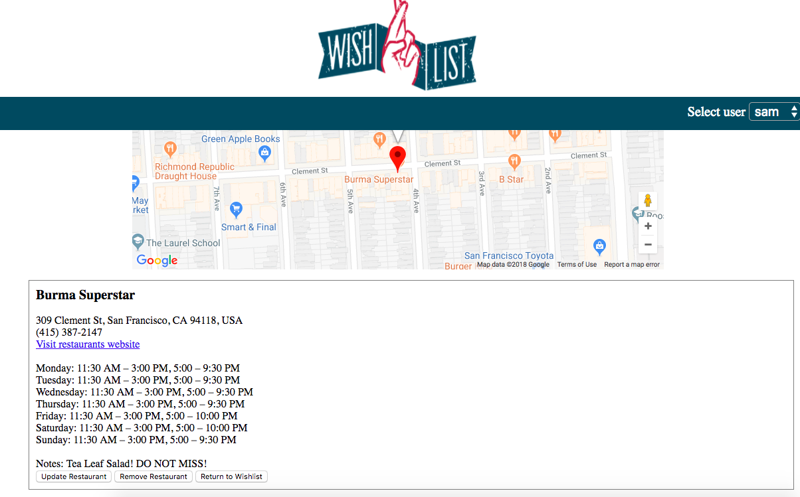

# Wishlist

Wishlist is an app that allows users to record restaurants they want to visit. Plugging into the Google Maps and Google Places APIs, the app automatically stores a restaurant's crucial information like location and hours, while also allowing the user to add their own notes based on friend's recommendations or their own personal experiences. Never again forget the name of that great spot your friend said you have to try!

Live Site: https://agile-scrubland-93857.herokuapp.com/

Restaurant Search:
----------------------------------------------------------------------------------------------

Individual Restaurant View:
----------------------------------------------------------------------------------------------

## Technology Stack

Front End: HTML, CSS, Javascript

Back End: Node.js, Express.js

Database: MongoDB

Hosting Services: Heroku, mLab

## CRUD Operations Breakdown
CREATE;
create entries of restaurants they want to visit

READ;
look their entries and other users?
sort by city

UPDATE;
edit their entries(enjoyed it, went to it, dishes theyd reccommend )

DELETE;
they can delete entry
they can delete account

## User Stories

Users should be able to CREATE "dream dining list" containing restaurants
Users should be able to UPDATE list
Users should be able to filter list(add city tag to list and sort by tag)
Users should be able to search for other users lists(READ)
Users should be able to DELETE their own list
Users should be able to add a review of a restaurant on their list

## What's next for Wishlist?

The next hurdle for Wishlist is about making interactions between users easier. We want to make it easy for users to share restaurant recommendations with each other, so that when you're visiting a new city it is easy for your friends to give you recommendations of where you should eat.

Technically we also want to make it possible to view all of the restaurants on a users Wishlist at one time. This will require taking advantage of marker clustering (more information below), so that areas densely populated with great restaurants are represented accordingly.

Marker Clustering:
https://developers.google.com/maps/documentation/javascript/marker-clustering

